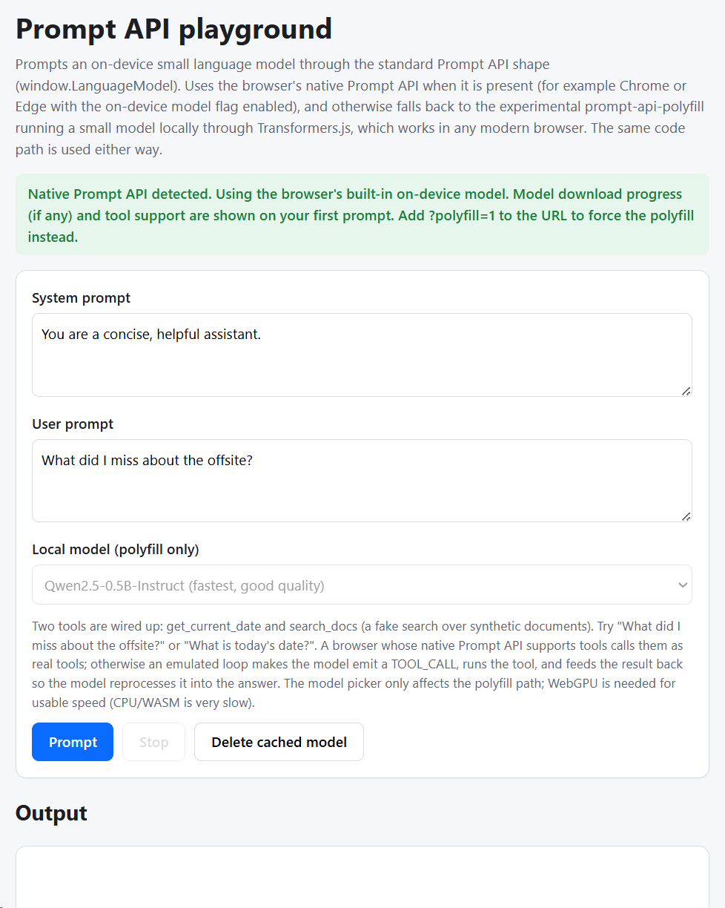

# Prompt API polyfill playground

A tiny, single-page web app for experimenting with the browser
[Prompt API][spec] (`window.LanguageModel`). It prompts a small language model
that runs **on your device**, and works in **any modern browser**:

- If your browser has the native Prompt API, it uses it directly (for example
  [Chrome or Edge][edge-docs] with the on-device model flag enabled).
- Otherwise it loads the experimental [`prompt-api-polyfill`][polyfill], which
  runs a small model locally in the browser via [Transformers.js][transformers]
  (WebGPU where available, WASM/CPU otherwise).

The same code runs against both. You get a model picker, live model-download
progress, streaming output, and two demo tools (`get_current_date` and a fake
`search_docs`) that show tool use.

**Live demo: <https://baronkhan.github.io/prompt-api-polyfill-playground/>**



## Try it

The quickest way is the [live demo](https://baronkhan.github.io/prompt-api-polyfill-playground/)
above: open it, then click **Prompt**.

To run it locally you need [Node.js][node] 18 or newer. Then:

```sh
git clone https://github.com/BaronKhan/prompt-api-polyfill-playground.git
cd prompt-api-polyfill-playground
npm install
npm start
```

Now open **<http://localhost:5173/>** in your browser and click **Prompt**.

> On the first run the polyfill downloads the model (up to a few hundred MB) and
> caches it. WebGPU is needed for good speed; on CPU/WASM a single answer can take
> tens of seconds. Check your WebGPU status at `chrome://gpu` or `edge://gpu`.

Yarn works too (`yarn install && yarn start`).

## Tips

- Add `?polyfill=1` to the URL (`http://localhost:5173/?polyfill=1`) to force the
  polyfill even when your browser has a native Prompt API.
- Use the **Delete cached model** button to clear the downloaded weights and
  switch models cleanly.

## How tool calling works

This playground **always uses emulated (assistant-role) tool calling**, for both
the native Prompt API and the polyfill. The model is told to emit a `TOOL_CALL`
line, the app runs the matching tool, feeds the result back as another turn, and
the model reprocesses it into the final answer. This follows the Prompt API
spec's [emulating tool use via assistant-role prompts][spec-emulate] pattern.

> **Note for developers (August 2026).** The Prompt API does define a native
> tool API (`create({ tools })`), and Edge accepts it behind a tool-use flag.
> However, on current shipping on-device models it is unreliable: the model
> frequently echoes the tool schema back as text instead of calling the tool and
> answering. Because of that, this playground drives the tools itself with the
> emulated loop, which produces clean, consistent output on both providers. If
> and when on-device models handle native tool calls well, switching the native
> path to `create({ tools })` would be straightforward. This note reflects the
> state as of August 2026, verified in Edge Dev with the tool-use flag enabled.

## References

- Prompt API specification: <https://webmachinelearning.github.io/prompt-api/>
- Prompt API in Microsoft Edge: <https://learn.microsoft.com/en-us/microsoft-edge/web-platform/prompt-api>
- `prompt-api-polyfill`: <https://github.com/GoogleChromeLabs/web-ai-demos/tree/main/prompt-api-polyfill>
- Transformers.js: <https://huggingface.co/docs/transformers.js>

## License

MIT. See [LICENSE](LICENSE).

[spec]: https://webmachinelearning.github.io/prompt-api/
[spec-emulate]: https://github.com/webmachinelearning/prompt-api/tree/ab9f257440ea6353aaf631d074ad1b9900992c6c?tab=readme-ov-file#emulating-tool-use-or-function-calling-via-assistant-role-prompts
[edge-docs]: https://learn.microsoft.com/en-us/microsoft-edge/web-platform/prompt-api
[polyfill]: https://github.com/GoogleChromeLabs/web-ai-demos/tree/main/prompt-api-polyfill
[transformers]: https://huggingface.co/docs/transformers.js
[node]: https://nodejs.org/
